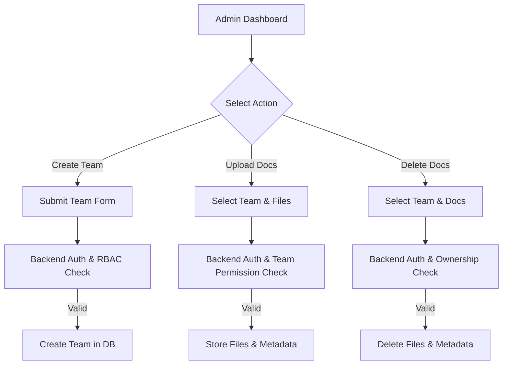

# Admin Team Management

## Overview

The **Admin Team Management** module enables administrators to manage teams and their associated knowledge securely.
This includes **creating teams**, **uploading team-specific documents**, and **deleting documents**, all enforced through **backend authentication and role-based access control (RBAC)**.

This feature is a core part of the **AI Knowledge Intelligence Platform**, ensuring **data isolation**, **security**, and **enterprise-grade governance**.

---

## Key Objectives

* Allow admins to create and manage teams
* Enforce strict authentication and authorization on all actions
* Isolate documents by team to prevent data leakage
* Support AI knowledge ingestion through team-scoped documents
* Ensure backend-only trust (frontend is never authoritative)

---

## Roles & Permissions

| Role  | Permissions                                      |
| ----- | ------------------------------------------------ |
| Admin | Create teams, upload documents, delete documents |
| User  | View and query documents based on assigned team  |

> ⚠️ All permissions are validated **on the backend**.
> Client-provided role or team data is ignored.

---

## Feature Breakdown

### 1. Create Team

**Description**
Allows an admin to create a new team within the organization.

**Flow**

1. Admin clicks **Create Team** from the dashboard
2. Admin fills in team details
3. Form data is sent to the backend API
4. Backend verifies:

   * Valid JWT
   * Admin role
5. Team is created in the database
6. Success response is returned

**Backend Guarantees**

* Only admins can create teams
* Duplicate or invalid team data is rejected

---

### 2. Upload Documents to Team

**Description**
Allows an admin to upload documents scoped to a specific team.

**Flow**

1. Admin selects a team from the dashboard
2. Admin selects one or more files
3. Files are uploaded to the backend
4. Backend verifies:

   * Authentication
   * Admin permissions
   * Admin belongs to the selected team
5. Files are stored under the team’s namespace
6. Metadata is saved and indexed for AI retrieval

**Supported File Types**

* PDF
* Text-based documents

**Backend Guarantees**

* Files are isolated per team
* Documents are indexed only for the selected team
* Uploads are rejected if permission checks fail

---

### 3. Delete Documents from Team

**Description**
Allows an admin to delete documents belonging to a specific team.

**Flow**

1. Admin selects a team
2. Admin selects document(s)
3. Admin clicks **Delete**
4. Backend verifies:

   * Authentication
   * Admin role
   * Document ownership under the selected team
5. File and metadata are deleted
6. Success response is returned

**Failure Cases**

* Unauthorized access → `403 Forbidden`
* Document not found → `404 Not Found`

---

## High-Level Flowchart



---

## Architecture Overview

```
Admin Dashboard (Next.js)
        |
        | Authenticated API Request (JWT)
        v
Backend API (Next.js Server)
        |
        | Service Role Access
        v
Supabase (Auth, Database, Storage)
```

* **Frontend**: UI only
* **Backend**: Security gatekeeper
* **Supabase**: Auth, RLS, storage, and data persistence

---

## Security Model

* JWT verification on every request
* Role fetched from database, not client
* Team ownership validated before file operations
* Backend-only access to Supabase service role
* No direct frontend-to-database access

---

## Example API Endpoints

```http
POST   /api/admin/teams
POST   /api/admin/teams/:teamId/documents
DELETE /api/admin/teams/:teamId/documents
```

---

## Why This Design Matters

* Prevents unauthorized access and data leaks
* Supports AI RAG with team-scoped knowledge
* Aligns with real-world enterprise systems
* Easy to audit, extend, and scale
* Fully compliant with RBAC best practices

---

## Related Modules

* Admin User Management
* AI Knowledge Chat (RAG)
* Organization System
* Document Indexing & Retrieval
* Analytics Dashboard
